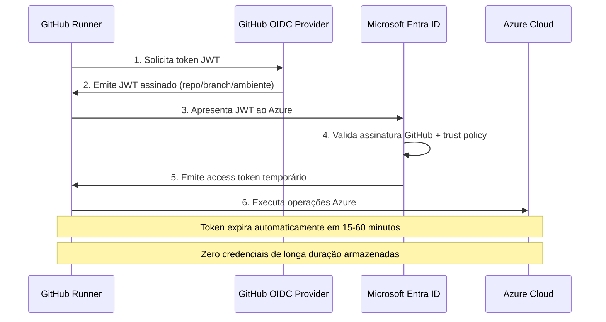

# GitHub Actions Secrets: Protegendo Suas Credenciais do Jeito Certo

> **Guia Completo:** Do básico ao avançado em segurança de credenciais  
> **Nível:** Intermediário → Avançado  

## 🎯 Por Que Isso Importa?

Colocar credenciais diretamente no código YAML é um dos erros mais perigosos em CI/CD — e acontece mais frequentemente do que você imagina. Esse erro não é exclusivo de iniciantes; ocorre em projetos sérios e equipes grandes, geralmente quando há pressa e a pessoa pensa *"ah, vou resolver isso depois"*.

**"Depois"** pode ser quando a credencial já foi usada para gastar milhares de dólares em recursos de cloud na sua conta. **Isso acontece todos os dias no mundo real.**

Este guia apresenta **4 níveis progressivos** de proteção de credenciais no GitHub Actions, desde o básico essencial até OIDC — o estado da arte em autenticação sem credenciais de longa duração.

---

## 🔐 Nível 1 — Repository Secrets: O Básico Essencial

### Entendendo os Secrets do GitHub

Os **Secrets** do GitHub Actions são variáveis de ambiente criptografadas com características únicas de segurança:

#### Características Técnicas:
- **Algoritmo de Criptografia:** Libsodium sealed boxes
- **Acesso Zero-Knowledge:** Nem o próprio GitHub consegue ver o valor após armazenamento
- **Proteção Automática:** Valores aparecem automaticamente como `***` nos logs
- **⚠️ Limitação Importante:** A redação automática não é garantida em 100% dos casos

### Configuração Prática

#### Passo 1: Criar Repository Secrets
**Navegação:** `Settings → Secrets and variables → Actions → New repository secret`

#### Passo 2: Convenções de Nomenclatura
```bash
✅ Correto:
AZURE_CLIENT_SECRET
DATABASE_URL_PRODUCTION
API_KEY_STAGING

❌ Incorreto:
azureClientSecret      # camelCase não é padrão
DB_URL                # muito genérico
GITHUB_SECRET         # prefixo GITHUB_ é reservado
```

#### Passo 3: Implementação no Workflow

```yaml
# ❌ NUNCA faça isso - credencial exposta
env:
  AZURE_CLIENT_SECRET: "abc123-super-secreto"
 
# ✅ Implementação segura
jobs:
  deploy:
    runs-on: ubuntu-latest
    steps:
      - name: Checkout code
        uses: actions/checkout@v4
        
      - name: Deploy com credenciais seguras
        env:
          AZURE_CLIENT_ID: ${{ secrets.AZURE_CLIENT_ID }}
          AZURE_CLIENT_SECRET: ${{ secrets.AZURE_CLIENT_SECRET }}
          AZURE_TENANT_ID: ${{ secrets.AZURE_TENANT_ID }}
        run: |
          chmod +x ./deploy.sh
          ./deploy.sh
```

### Limitações do Repository Secrets

**Problemas de Escopo:**
- Acessível a **todos os workflows** do repositório
- Qualquer desenvolvedor com **write access** pode referenciar nos workflows
- **Risco:** Staging e produção compartilhando as mesmas credenciais

Essas limitações nos levam ao próximo nível de segurança.

---

## 🏗 Nível 2 — Environment Secrets: Isolamento por Ambiente

### O Problema Resolvido

**Cenário Comum de Risco:**
1. Secret `DATABASE_URL` configurado com URL de produção
2. Qualquer workflow (qualquer branch) pode acessar
3. **Resultado:** Acesso acidental à produção por código de desenvolvimento

### Solução: Environment-Based Secrets

Os **Environment Secrets** criam isolamento verdadeiro entre ambientes, permitindo:
- Secrets específicos por ambiente (staging, production, etc.)
- Controles de acesso granulares
- Aprovação obrigatória para ambientes críticos

### Configuração de Environments

#### Para Ambiente de Produção:
1. `Settings → Environments → New environment → 'production'`
2. **Ativar:** Required reviewers (adicionar tech lead/senior)
3. **Configurar:** Protection rules e deployment branches

#### Para Ambiente de Staging:
- Mesmo processo, **sem required reviewers** (evitar travamento do desenvolvimento)

### Implementação Prática

```yaml
name: Deploy Multi-Environment

on:
  push:
    branches: [main, develop]

jobs:
  deploy-staging:
    runs-on: ubuntu-latest
    environment: staging          # Acessa secrets específicos de staging
    if: github.ref == 'refs/heads/develop'
    steps:
      - uses: actions/checkout@v4
      - name: Deploy para Staging
        env:
          DATABASE_URL: ${{ secrets.DATABASE_URL }}  # Valor de staging
          API_KEY: ${{ secrets.API_KEY }}
        run: |
          echo "Deployment para ambiente de STAGING"
          ./deploy.sh staging
 
  deploy-production:
    runs-on: ubuntu-latest
    environment: production       # Requer aprovação + secrets de produção
    if: github.ref == 'refs/heads/main'
    steps:
      - uses: actions/checkout@v4
      - name: Deploy para Production
        env:
          DATABASE_URL: ${{ secrets.DATABASE_URL }}  # Valor de produção
          API_KEY: ${{ secrets.API_KEY }}
        run: |
          echo "Deployment para PRODUÇÃO - Aprovado!"
          ./deploy.sh production
```

### Fluxo de Segurança

1. **Staging:** Execução imediata com credenciais de desenvolvimento
2. **Production:** Pausa para aprovação → Executa com credenciais de produção
3. **Mesmo nome de secret,** valores completamente diferentes baseados no environment

### Boas Práticas de Rotação

**Cronograma recomendado para rotação:**
- **Credenciais críticas de produção:** 30 dias
- **Credenciais de alto risco:** 60 dias
- **Demais credenciais:** 90 dias

---

## 🏢 Nível 3 — Organization Secrets: Escalando para Múltiplos Repositórios

### O Desafio da Escala

**Problema:** Organização com 10+ repositórios necessitando das mesmas credenciais:
- Container registry credentials
- Cloud subscription IDs  
- Shared service accounts

**Consequências do approach manual:**
- **10 repositórios** × **rotação mensal** = **120 atualizações/ano**
- Alto risco de inconsistências
- Overhead operacional significativo

### Organization Secrets: A Solução

Os **Organization Secrets** permitem:
- **Criação centralizada:** Um secret, múltiplos repositórios
- **Controle granular:** Acesso por repositórios específicos  
- **Hierarquia clara:** Precedência bem definida

### Configuração

#### Criando Organization Secrets:
**Navegação:** `Organization Settings → Secrets and variables → Actions → New organization secret`

#### Opções de Visibilidade:
```bash
✅ Recomendado: Selected repositories (controle granular)
⚠️  Cuidado: All repositories (muito permissivo)
⚠️  Cuidado: All private repositories (escopo amplo)
```

### Implementação

```yaml
name: Build and Deploy Multi-Repo

on:
  push:
    branches: [main]

jobs:
  build-and-push:
    runs-on: ubuntu-latest
    steps:
      - uses: actions/checkout@v4
      
      - name: Login Container Registry
        uses: docker/login-action@v3
        with:
          username: ${{ secrets.DOCKERHUB_USERNAME }}   # Organization Secret
          password: ${{ secrets.DOCKERHUB_TOKEN }}      # Organization Secret
      
      - name: Build and Push
        run: |
          docker build -t ${{ secrets.DOCKERHUB_USERNAME }}/app:${{ github.sha }} .
          docker push ${{ secrets.DOCKERHUB_USERNAME }}/app:${{ github.sha }}
  
  deploy:
    runs-on: ubuntu-latest
    needs: build-and-push
    environment: production
    steps:
      - name: Deploy com credenciais mistas
        env:
          # Organization Secrets (compartilhados)
          AZURE_SUBSCRIPTION_ID: ${{ secrets.AZURE_SUBSCRIPTION_ID }}
          DOCKER_REGISTRY: ${{ secrets.DOCKERHUB_USERNAME }}
          
          # Repository/Environment Secrets (específicos)
          DATABASE_URL: ${{ secrets.DATABASE_URL }}
        run: |
          echo "Deploy da imagem: $DOCKER_REGISTRY/app:${{ github.sha }}"
          ./deploy.sh
```

### Hierarquia de Precedência

**Ordem de resolução (maior → menor prioridade):**

1. **🥇 Environment Secrets** — Prioridade máxima
2. **🥈 Repository Secrets** — Escopo do repositório  
3. **🥉 Organization Secrets** — Backup/padrão

**Exemplo prático:**
- `DATABASE_URL` existe nos 3 níveis
- Environment `production` = URL de produção (ganha)
- Repository = URL de staging (ignorada)
- Organization = URL de desenvolvimento (ignorada)

### ⚠️ Considerações de Segurança

**Riscos dos Organization Secrets:**
- **Acesso padrão:** Todos os repositórios privados/internos
- **Empresas grandes:** Centenas de repositórios potencialmente acessando credenciais críticas

**Mitigação obrigatória:**
- **Sempre** usar "Selected repositories"
- Auditar regularmente quais repositórios têm acesso
- Documentar justificativa para cada acesso

---

## 🚀 Nível 4 — OIDC: Eliminando Credenciais de Longa Duração

### O Problema Fundamental

Mesmo com todas as práticas anteriores, persiste um **risco fundamental:**

**Credenciais de Longa Duração:**
- Client Secret criado hoje **existe até revogação manual**
- Se comprometido, **permanece válido** até descoberta
- **Janela de exposição:** Potencialmente meses ou anos

### OIDC (OpenID Connect): A Revolução

**Conceito transformador:**
- **Zero credenciais** armazenadas permanentemente
- GitHub **prova identidade** para cloud providers
- Cloud provider **emite tokens temporários** (expiram em minutos)
- **Eliminação completa** do risco de credenciais expostas

### Arquitetura do Fluxo OIDC



### Setup Completo do OIDC com Azure

#### Passo 1: Azure App Registration

```bash
# Criar App Registration
az ad app create --display-name "github-actions-oidc-meu-projeto"

# Anotar valores retornados:
# appId = AZURE_CLIENT_ID
# tenant = AZURE_TENANT_ID
```

#### Passo 2: Federated Identity Credential

```bash
# Configurar trust policy específico
export APPLICATION_ID="seu-app-id"
export GITHUB_ORG="sua-org"  
export GITHUB_REPO="seu-repo"

az ad app federated-credential create \
  --id $APPLICATION_ID \
  --parameters '{
    "name": "github-actions-main",
    "issuer": "https://token.actions.githubusercontent.com",
    "subject": "repo:'$GITHUB_ORG'/'$GITHUB_REPO':ref:refs/heads/main",
    "audiences": ["api://AzureADTokenExchange"]
  }'
```

#### Passo 3: Service Principal e Permissions

```bash
# Criar Service Principal
az ad sp create --id $APPLICATION_ID

# Atribuir permissões (princípio do menor privilégio)
export SUBSCRIPTION_ID="sua-subscription"
export RESOURCE_GROUP="seu-rg"

# Escopo restrito ao resource group (recomendado)
az role assignment create \
  --role "Contributor" \
  --assignee $APPLICATION_ID \
  --scope "/subscriptions/$SUBSCRIPTION_ID/resourceGroups/$RESOURCE_GROUP"
```

#### Passo 4: GitHub Secrets (Apenas IDs, sem credenciais!)

```bash
# Secrets necessários (todos são IDs públicos, não credenciais)
AZURE_CLIENT_ID      # App Registration ID
AZURE_TENANT_ID      # Directory ID  
AZURE_SUBSCRIPTION_ID # Subscription ID

# ❌ NÃO criar: AZURE_CLIENT_SECRET (OIDC não usa!)
```

### Implementação do Workflow OIDC

```yaml
name: Deploy com OIDC (Zero Credenciais)

on:
  push:
    branches: [main]
  workflow_dispatch:

jobs:
  deploy-oidc:
    runs-on: ubuntu-latest
    permissions:
      id-token: write    # 🔑 OBRIGATÓRIO para OIDC
      contents: read
    steps:
      - uses: actions/checkout@v4

      - name: Autenticação Azure via OIDC
        uses: azure/login@v2
        with:
          client-id: ${{ secrets.AZURE_CLIENT_ID }}
          tenant-id: ${{ secrets.AZURE_TENANT_ID }}
          subscription-id: ${{ secrets.AZURE_SUBSCRIPTION_ID }}
          # 🎯 Zero client secrets necessários!

      - name: Deploy Aplicação
        run: |
          echo "🚀 Deploy com token temporário OIDC"
          
          # Deploy de Web App
          az webapp deploy \
            --resource-group meu-rg \
            --name minha-webapp \
            --src-path ./dist

      - name: Cache Management
        run: |
          # Purge CDN
          az cdn endpoint purge \
            --resource-group meu-rg \
            --profile-name meu-cdn \
            --name meu-endpoint \
            --content-paths '/*'
            
          echo "✅ Deploy concluído - token já expirou automaticamente"
```

### Comparação: Tradicionais vs. OIDC

| Aspecto | Secrets Tradicionais | OIDC |
|---|---|---|
| **Armazenamento** | Client secrets permanentes | Zero credenciais armazenadas |
| **Duração** | Meses/Anos | 15-60 minutos |
| **Risco de Exposição** | Alto (permanente até revogação) | Mínimo (auto-expira) |
| **Rotação** | Manual obrigatória | Automática |
| **Trust Policy** | Baseado em credencial | Baseado em identidade |
| **Auditoria** | Limitada | Completa (Azure AD logs) |
| **Manutenção** | Alta | Zero |

### Configurações Avançadas de Segurança

#### Multi-Environment Setup

```bash
# Production: Apenas environment específico
az ad app federated-credential create \
  --id $APPLICATION_ID \
  --parameters '{
    "name": "github-production",
    "issuer": "https://token.actions.githubusercontent.com",
    "subject": "repo:'$GITHUB_ORG'/'$GITHUB_REPO':environment:production",
    "audiences": ["api://AzureADTokenExchange"]
  }'

# Staging: Branch develop
az ad app federated-credential create \
  --id $APPLICATION_ID \
  --parameters '{
    "name": "github-staging",
    "issuer": "https://token.actions.githubusercontent.com", 
    "subject": "repo:'$GITHUB_ORG'/'$GITHUB_REPO':ref:refs/heads/develop",
    "audiences": ["api://AzureADTokenExchange"]
  }'
```

### Troubleshooting OIDC

#### Erros Comuns:

**1. "No matching federated identity record found"**
```bash
# Verificar se subject está correto
# Formato: repo:org/repo:ref:refs/heads/branch
# Deve corresponder exatamente ao workflow execution context
```

**2. "The signed in user is not assigned to a role"**
```bash
# Service Principal precisa de role assignment
az role assignment list --assignee $APPLICATION_ID
```

**3. Workflow falha na autenticação**
```yaml
# Verificar permissions obrigatórias
permissions:
  id-token: write  # Essencial para OIDC
  contents: read
```

---

## ✅ Checklist de Implementação Completa

### Auditoria Atual:
- [ ] **Scan de credenciais expostas** no histórico do git
- [ ] **Inventário de secrets** em todos os repositórios
- [ ] **Identificação de credenciais** de longa duração ativas

### Implementação por Nível:

#### 🔐 Nível 1 - Basics:
- [ ] Migrar **todas as credenciais** do código para secrets
- [ ] Aplicar **convenções de nomenclatura** consistentes
- [ ] Implementar **CI job** para detectar credenciais expostas

#### 🏗 Nível 2 - Environments:
- [ ] Criar environments **staging** e **production**
- [ ] Configurar **required reviewers** para produção
- [ ] **Separar completamente** credenciais por ambiente

#### 🏢 Nível 3 - Organization:
- [ ] Identificar **secrets compartilháveis** entre repositórios
- [ ] Migrar para **organization secrets** com escopo limitado
- [ ] **Documentar** quais repositórios acessam quais secrets

#### 🚀 Nível 4 - OIDC:
- [ ] **Setup completo** OIDC para cloud providers principais
- [ ] **Eliminar** todos os client secrets de longa duração
- [ ] **Configurar** trust policies restritivas

### Manutenção Contínua:
- [ ] **Cronograma de rotação** automatizado
- [ ] **Auditoria trimestral** de acessos
- [ ] **Monitoramento** de tentativas de acesso não autorizadas
- [ ] **Alertas** para secrets próximos do vencimento

---

## 🛡️ Impacto na Segurança: Dados Reais

### Estatísticas de Risco:
- **GitGuardian 2024:** 12.8 milhões de secrets expostos em repositórios públicos
- **Custo médio** de vazamento de credencial: $4.88M (IBM Security Report)
- **Tempo médio** para detectar vazamento: 277 dias
- **GitHub Secret Scanning:** Detecta automaticamente 200+ tipos de secrets

### ROI da Implementação OIDC:
- **Zero** horas/mês em rotação manual de credenciais
- **Zero** risco de credenciais permanentes expostas  
- **100%** auditabilidade via cloud provider logs
- **Redução de 99%** na superfície de ataque relacionada à credenciais

---

## 🔗 Recursos Adicionais

### Documentação Oficial:
- [GitHub Actions Security Hardening](https://docs.github.com/actions/security-guides/security-hardening-for-github-actions)
- [Azure OIDC Configuration](https://docs.github.com/actions/deployment/security-hardening-your-deployments/configuring-openid-connect-in-azure)
- [AWS OIDC Setup](https://docs.github.com/actions/deployment/security-hardening-your-deployments/configuring-openid-connect-in-amazon-web-services)
- [GCP OIDC Configuration](https://docs.github.com/actions/deployment/security-hardening-your-deployments/configuring-openid-connect-in-google-cloud-platform)

### Ferramentas de Segurança:
- **[truffleHog](https://github.com/trufflesecurity/trufflehog):** Scan histórico de credenciais
- **[git-secrets](https://github.com/awslabs/git-secrets):** Pre-commit hooks
- **[secretlint](https://github.com/secretlint/secretlint):** Linting de secrets
- **[GitHub Secret Scanning](https://docs.github.com/code-security/secret-scanning):** Scanner nativo

### 📚 Próximos Passos:
1. **Cache Strategies** em GitHub Actions
2. **Matrix Builds** para otimização de CI/CD
3. **Self-hosted Runners** para casos específicos
4. **Advanced Workflows** com reusable workflows

---

## 🎯 Conclusão

A evolução da segurança de credenciais em CI/CD não é apenas uma questão técnica — é um **imperativo de negócio**. A implementação progressiva dos 4 níveis apresentados transforma:

**De:** Credenciais expostas → Vazamentos → Custos inesperados → Reputação comprometida

**Para:** Zero credenciais permanentes → Auditoria completa → Compliance automático → Confiança total

O **OIDC representa o futuro** da autenticação em CI/CD: elimine completamente o risco de credenciais de longa duração e abrace a segurança baseada em identidade.

**Comece hoje.** Sua organização e sua reputação profissional dependem disso.

---

*Este guia é parte da série "GitHub Actions na Prática" - cobrindo desde conceitos básicos até implementações enterprise-grade.*